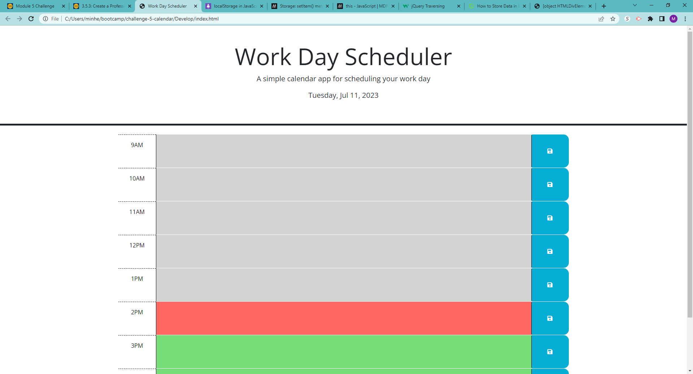
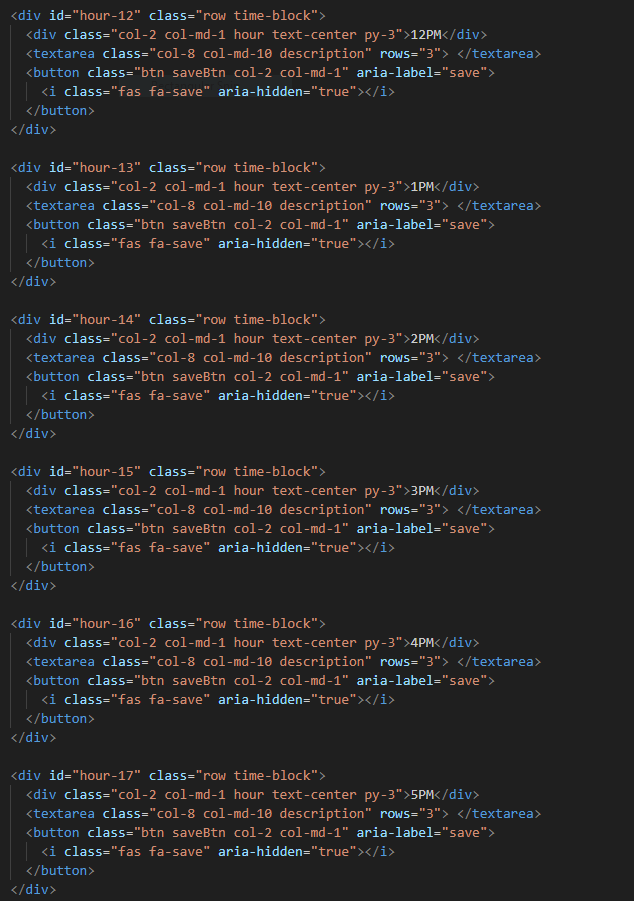
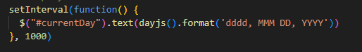
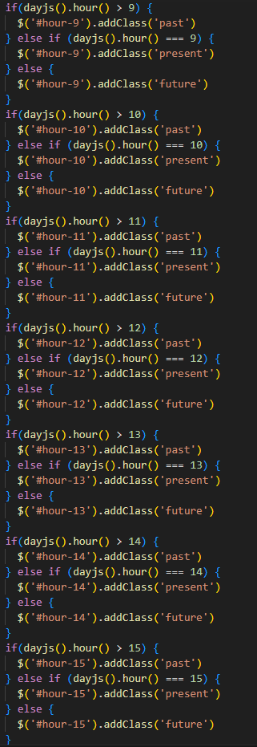
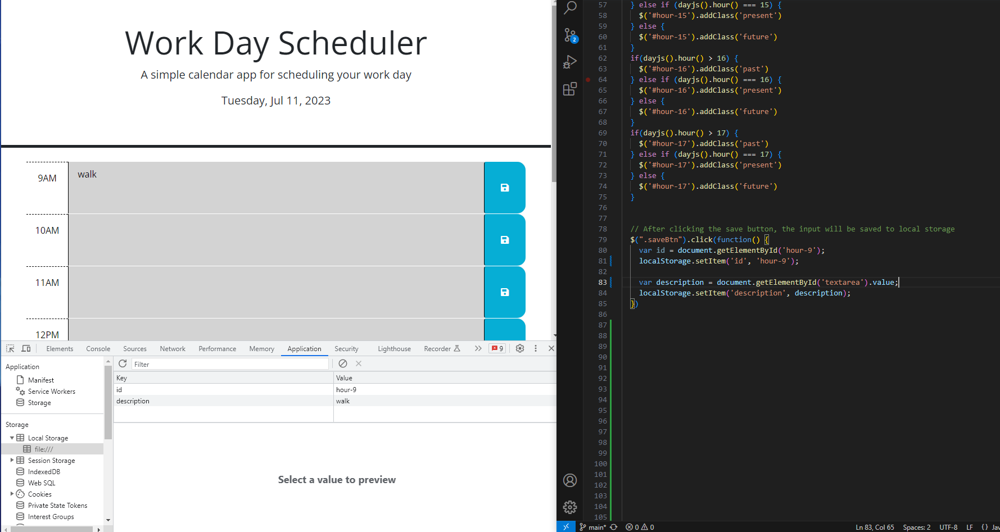

# challenge-5-calendar

## Description

This calendar app lets users know the current hour within a 9-5 work schedule, shown by colors. Users can type in an event or to do that they want to plan by the hour and it will save to the local storage so that it will be there for them to refer to. This program was created using HTML, CSS, and JavaScript. 

## Installation

N/A

## Usage

This screenshot is an example of what the webpage would look like if it was 2pm. The hours before 2pm are greyed out, 2pm is red, and the hours after 2pm are green. 

Extra boxes were made with the HTML code, up to hour 17, using the same code as the boxes given.

This code snippet shows the current date when the application is opened.

This code snippet makes sure that the color styles are applied to the different hours based on certain conditions, making it possible for the past hours to be grey, present hour to be red, and future hours to be green.

At the moment, I've only managed to get what is inputted into 9am to get stored into the local storage with the id as the hour and description as what is inputted. 

## Credits

dayjs: https://day.js.org/docs/en/get-set/hour
w3schools: https://www.w3schools.com/jquery/jquery_css_classes.asp
https://www.w3schools.com/jquery/jquery_events.asp